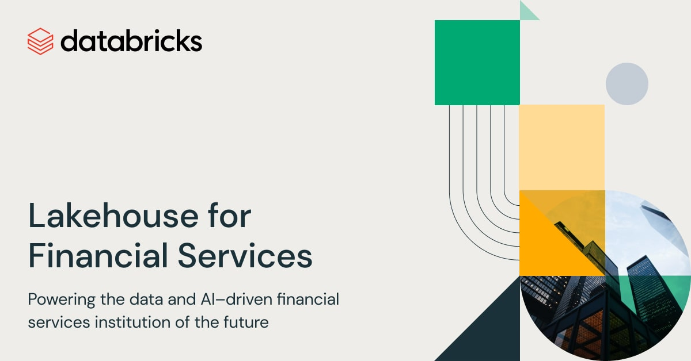
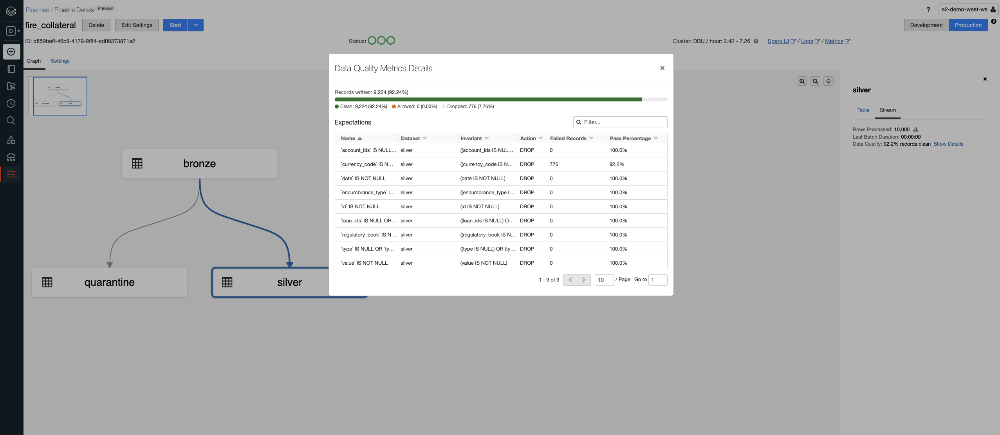

Following the launch of the [Lakehouse for Financial Services](https://databricks.com/solutions/industries/financial-services), 
we created that project to convert data models expressed as JSON schema into spark Schema and Delta Live Tables expectations.

## Usage

We specify the name of the entity to get the data model for as well as the directory (distributed file storage) where 
our JSON schema are stored. 

```python
from lh4fs.schema import JsonBuilder
schema, constraints = JsonBuilder('/path/to/json/models').build("employee")
```

### Retrieve schema and constraints

Even though records may sometimes "look" structured (e.g. JSON files), enforcing a schema is not just a good practice; 
in enterprise settings, it guarantees any missing field is still expected, unexpected fields are discarded and data 
types are fully evaluated (e.g. a date should be treated as a date object and not a string). 
Using LH4FS pyspark module, we retrieve the spark schema required to process a given entity (e.g. derivative) 
that we apply on batch or on real-time (e.g. over a stream of raw records). This process is called data schematization.

```json
{"metadata":{"desc":"Employee ID"},"name":"id","nullable":false,"type":"integer"}
{"metadata":{"desc":"Employee personal information"},"name":"person","nullable":false,"type":{"fields":[{"metadata":{"desc":"A person name, first or last"},"name":"first_name","nullable":true,"type":"string"},{"metadata":{"desc":"person last name"},"name":"last_name","nullable":true,"type":"string"},{"metadata":{"desc":"Person birth date"},"name":"birth_date","nullable":true,"type":"date"},{"metadata":{"desc":"employee nickname"},"name":"username","nullable":true,"type":"string"}],"type":"struct"}}
{"metadata":{"desc":"Employee first day of employment"},"name":"joined_date","nullable":true,"type":"date"}
{"metadata":{"desc":"Number of high fives"},"name":"high_fives","nullable":true,"type":"double"}
{"metadata":{"desc":"Employee skills"},"name":"skills","nullable":true,"type":{"containsNull":true,"elementType":"string","type":"array"}}
{"metadata":{"desc":"Employee role"},"name":"role","nullable":true,"type":"string"}
```

Applying a schema is one thing, enforcing its constraints is another. Given the schema definition of an entity, 
we can detect if a field is required or not. Given an enumeration object, we ensure its value consistency 
(e.g. country code). In addition to the technical constraints derived from the schema itself, the model also reports 
business expectations using e.g. minimum, maximum, maxItems, pattern JSON parameters. 
All these technical and business constraints will be programmatically retrieved from our JSON model and interpreted 
as a series of SQL expressions.

```json
{
  "[`high_fives`] VALUE": "`high_fives` IS NULL OR `high_fives` BETWEEN 1.0 AND 300.0",
  "[`id`] NULLABLE": "`id` IS NOT NULL",
  "[`person`.`username`] MATCH": "`person`.`username` IS NULL OR `person`.`username` RLIKE '^[a-z0-9]{2,}$'",
  "[`person`] NULLABLE": "`person` IS NOT NULL",
  "[`role`] VALUE": "`role` IS NULL OR `role` IN ('SA','CSE','SSA','RSA')",
  "[`skills`] SIZE": "`skills` IS NULL OR SIZE(`skills`) >= 1.0"
}
```

### Delta Live Tables

Our first step is to retrieve files landing to a distributed file storage using Spark auto-loader 
(though this framework can easily be extended to read different streams, using a Kafka connector for instance). 
In continuous mode, files will be processed as they land, `max_files` at a time. 
In triggered mode, only new files will be processed since last run. 
Using Delta Live Tables, we ensure the execution and processing of delta increments, preventing organizations 
from having to maintain complex checkpointing mechanisms to understand what data needs to be processed next; 
delta live tables seamlessly handles records that haven't yet been processed, first in first out.

```python
@dlt.create_table()
def bronze():
    return (
        spark
            .readStream
            .format('XXX')  # we read standard data sources, json, csv, jdbc, etc.
            .schema(schema)  # ... but enforce schema
            .build('/path/to/data/files')
    )
```

Our pipeline will evaluate our series of SQL rules against our schematized dataset (i.e. reading from Bronze), 
dropping record breaching any of our expectations through the `expect_all` pattern and reporting on data quality 
in real time

```python
@dlt.create_table()
@dlt.expect_all(constraints) # we enforce expectations and may drop record, ignore or fail pipelines
def silver():
  return dlt.read_stream("bronze")
```




## Roadmap

We plan to integrate the legend stack following our contribution to [FINOS](https://github.com/finos-labs/legend-delta).
We aim at keeping some sort of consistency with JSON models as follows

```python
from lh4fs.schema import LegendBuilder
schema, constraints = LegendBuilder('/path/to/legend/models').build("employee")
```

## Project support
Please note that all projects in the /databrickslabs github account are provided for your exploration only, and are not formally supported by Databricks with Service Level Agreements (SLAs). They are provided AS-IS and we do not make any guarantees of any kind. Please do not submit a support ticket relating to any issues arising from the use of these projects.

Any issues discovered through the use of this project should be filed as GitHub Issues on the Repo. They will be reviewed as time permits, but there are no formal SLAs for support.

## Authors
<antoine.amend@databricks.com>